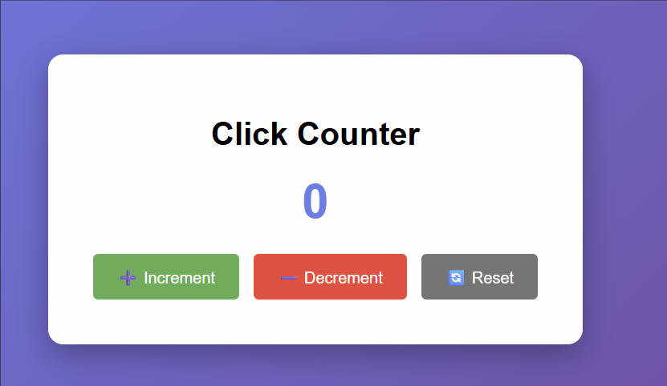

# <div align="center">🎨 Open Web Playground</div>

<div align="center">

### *Your gateway to web development mastery*

**A beautiful, beginner-friendly playground for learning HTML, CSS, and JavaScript**

<br>

[](LICENSE)
[](CONTRIBUTING.md)
[](https://hacktoberfest.com/)
[]()

<br>

**[🚀 Quick Start](#-quick-start) • [📚 Examples](#-interactive-examples) • [🤝 Contribute](#-contributing) • [💬 Community](#-community)**

<br>


</div>

<br>

## 🌟 What Makes Us Special

<table>
<tr>
<td width="33%" align="center">

<h3>Learn by Doing</h3>
<p>Interactive examples that you can see, touch, and modify in real-time</p>
</td>
<td width="33%" align="center">

<h3>Beginner Friendly</h3>
<p>Designed specifically for first-time contributors and learners</p>
</td>
<td width="33%" align="center">

<h3>Zero Setup</h3>
<p>No complex build tools or frameworks—just open and start coding</p>
</td>
</tr>
</table>

<br>

## 💡 About This Project

> *"The journey of a thousand miles begins with a single step."* — Lao Tzu

**Open Web Playground** is more than just a code repository—it's a **learning community** where aspiring developers take their first steps into the world of web development and open-source contribution.

### 🎯 Our Mission

We exist to **demolish the barriers** that make web development and open-source contribution feel intimidating:

<table>
<tr>
<td width="50%">

#### 🚫 The Problem
- Complex frameworks overwhelm beginners
- Open-source feels exclusive and scary
- No clear path from "hello world" to real projects
- Testing seems like advanced magic

</td>
<td width="50%">

#### ✅ Our Solution
- Pure vanilla JavaScript—no frameworks
- Welcoming community with mentorship
- Bite-sized examples with clear progression
- Simple Jest tests anyone can understand

</td>
</tr>
</table>

### 🎁 What You'll Gain

```
┌─────────────────────────────────────────────────────────────┐
│  ✨ Practical Skills                                        │
│  • Master HTML, CSS, and JavaScript fundamentals            │
│  • Learn industry-standard testing with Jest                │
│  • Understand real-world UI patterns                        │
│                                                              │
│  🌱 Open Source Experience                                  │
│  • Make your first pull request in a safe environment       │
│  • Learn Git workflow and code review process               │
│  • Build your GitHub contribution graph                     │
│                                                              │
│  🤝 Community Support                                       │
│  • Get feedback from experienced developers                 │
│  • Help others and reinforce your learning                  │
│  • Join a welcoming, judgment-free community                │
└─────────────────────────────────────────────────────────────┘
```

<br>

<div align="center">


</div>

<br>

## 🛠️ Technology Stack

<div align="center">

<table>
<tr>
<td align="center" width="100">

<br><strong>HTML5</strong>
</td>
<td align="center" width="100">

<br><strong>CSS3</strong>
</td>
<td align="center" width="100">

<br><strong>JavaScript</strong>
</td>
<td align="center" width="100">

<br><strong>Jest</strong>
</td>
<td align="center" width="100">

<br><strong>Node.js</strong>
</td>
<td align="center" width="100">

<br><strong>npm</strong>
</td>
</tr>
</table>

**100% Vanilla** • **No Build Tools** • **No Frameworks** • **Just Pure Web Technology**

</div>

<br>

<div align="center">


</div>

<br>

## 🚀 Quick Start

<details open>
<summary><b>📋 Prerequisites</b></summary>

<br>

Before diving in, make sure you have these installed:

| Tool | Version | Download Link |
|------|---------|---------------|
| 🌐 **Web Browser** | Latest | [Chrome](https://www.google.com/chrome/) • [Firefox](https://www.mozilla.org/firefox/) • [Edge](https://www.microsoft.com/edge) |
| 📦 **Node.js** | v14+ | [nodejs.org](https://nodejs.org/) |
| 🔧 **Git** | Latest | [git-scm.com](https://git-scm.com/) |
| ✏️ **Code Editor** | Any | [VS Code](https://code.visualstudio.com/) *(recommended)* |

</details>

<details open>
<summary><b>⚡ Installation Steps</b></summary>

<br>

### Step 1️⃣: Clone the Repository

```bash
git clone https://github.com/Faizan-902/open-web-playground.git
cd open-web-playground
```

### Step 2️⃣: Install Dependencies

```bash
npm install
```

<sup>*This installs Jest and other testing tools. Required only if you want to run tests.*</sup>

### Step 3️⃣: Launch the Playground

**Option A: Double-click** `index.html` in your file explorer

**Option B: Use terminal commands**

```bash
# Windows
start index.html

# macOS
open index.html

# Linux
xdg-open index.html
```

### 🎉 You're Ready!

Your browser should now display the Open Web Playground landing page with links to all examples.

</details>

<br>

<div align="center">


</div>

<br>

## 📚 Interactive Examples

Each example is a **self-contained mini-project** designed to teach you specific web development concepts. No need to understand the entire codebase—just dive into what interests you!

<br>

<div align="center">

### 🎯 Available Examples

</div>

<table>
<tr>
<td width="50%">

### 🔢 01 • Button Counter
<sup>**Difficulty:** Beginner | **Time:** 10 min</sup>

A simple interactive counter that teaches the fundamentals of event handling and DOM manipulation.

**What You'll Learn:**
- ✓ Event listeners
- ✓ Updating the DOM
- ✓ Variable state management

```
examples/01-button-counter/
```

</td>
<td width="50%">

### ✅ 02 • Form Validation
<sup>**Difficulty:** Beginner | **Time:** 15 min</sup>

Client-side form validation with real-time feedback and error messages.

**What You'll Learn:**
- ✓ Input validation
- ✓ Regular expressions
- ✓ User feedback patterns

```
examples/02-form-validation/
```

</td>
</tr>
<tr>
<td width="50%">

### 📱 03 • Responsive Navigation
<sup>**Difficulty:** Intermediate | **Time:** 20 min</sup>

A mobile-friendly navigation menu that adapts to different screen sizes.

**What You'll Learn:**
- ✓ Responsive design
- ✓ CSS media queries
- ✓ Mobile-first approach

```
examples/03-responsive-nav/
```

</td>
<td width="50%">

### 🖼️ 04 • Image Gallery
<sup>**Difficulty:** Intermediate | **Time:** 25 min</sup>

An interactive image gallery with lightbox-style viewing experience.

**What You'll Learn:**
- ✓ Dynamic content loading
- ✓ Modal patterns
- ✓ Event delegation

```
examples/04-image-gallery/
```

</td>
</tr>
</table>

<br>

### 🎮 How to Use Examples

<div align="center">

```
🗂️ Navigate → 📂 Open → 🎨 View → ✏️ Edit → 🔄 Refresh → 🎉 Learn
```

</div>

1. **Browse** to `examples/<example-name>/` in your file explorer
2. **Open** `index.html` in your web browser
3. **Interact** with the live example
4. **Open** the same folder in your code editor
5. **Modify** the HTML, CSS, or JavaScript
6. **Refresh** your browser to see changes
7. **Experiment** until you understand how it works!

<br>

<div align="center">

> 💡 **Pro Tip:** Open the browser's DevTools (F12) to see console logs and debug your code in real-time!

</div>

<br>

<div align="center">


</div>

<br>

## 🧪 Testing Your Code

Testing isn't scary—it's **your safety net**! We use Jest to ensure our code works as expected.

<br>

<div align="center">

### 🎯 Test Commands

</div>

<table>
<tr>
<td width="33%" align="center">

### 🏃 Run Tests Once
```bash
npm test
```
<sup>Runs all tests and shows results</sup>

</td>
<td width="33%" align="center">

### 👀 Watch Mode
```bash
npm run test:watch
```
<sup>Auto-reruns tests when files change</sup>

</td>
<td width="33%" align="center">

### 📊 Coverage Report
```bash
npm run test:coverage
```
<sup>Shows which code is tested</sup>

</td>
</tr>
</table>

<br>

### 📈 Understanding Coverage

After running coverage, open `coverage/index.html` to see:

```
┌──────────────────────────────────────────┐
│  Coverage Report                         │
├──────────────────────────────────────────┤
│  ✅ Lines covered    │ 85%               │
│  ✅ Functions tested │ 90%               │
│  ✅ Branches checked │ 75%               │
│  📝 Overall score    │ 83.3%             │
└──────────────────────────────────────────┘
```

<div align="center">

**Green lines = Tested** 🟢 | **Red lines = Needs tests** 🔴

</div>

<br>

<div align="center">


</div>

<br>

## 🤝 Contributing

<div align="center">

### 💖 We Love Contributors!

**Every contribution matters—from fixing a typo to adding a new example.**

<br>

[](https://github.com/Faizan-902/open-web-playground/graphs/contributors)

</div>

<br>

### 🌈 Ways to Contribute

<table>
<tr>
<td width="50%">

#### 🔰 Perfect for Beginners

- 📝 Fix typos in documentation
- 🎨 Improve code comments
- 📸 Add screenshots of examples
- ✨ Enhance example styling
- 📚 Write tutorials or guides

</td>
<td width="50%">

#### 🚀 For Experienced Devs

- 🐛 Fix bugs and issues
- ✅ Add new examples
- 🧪 Write additional tests
- ♿ Improve accessibility
- ⚡ Optimize performance

</td>
</tr>
</table>

<br>

### 📋 Step-by-Step Contribution Guide

<details>
<summary><b>Click to expand the complete workflow</b></summary>

<br>

#### 1️⃣ Fork & Clone

```bash
# Fork this repo on GitHub, then clone your fork
git clone https://github.com/YOUR-USERNAME/open-web-playground.git
cd open-web-playground
```

#### 2️⃣ Create a Branch

```bash
git checkout -b feature/amazing-new-feature
# or
git checkout -b fix/bug-description
```

<sup>**Branch naming convention:** `feature/` for new features, `fix/` for bug fixes, `docs/` for documentation</sup>

#### 3️⃣ Make Your Changes

- Write clean, readable code
- Add comments where needed
- Follow existing code style
- Test your changes thoroughly

#### 4️⃣ Test Everything

```bash
npm test
```

<sup>**All tests must pass before submitting!** ✅</sup>

#### 5️⃣ Commit Your Work

```bash
git add .
git commit -m "Add: brief description of your change"
```

<sup>**Commit message prefixes:** `Add:` `Fix:` `Update:` `Remove:` `Docs:`</sup>

#### 6️⃣ Push to GitHub

```bash
git push origin feature/amazing-new-feature
```

#### 7️⃣ Open a Pull Request

1. Go to your fork on GitHub
2. Click "Compare & pull request"
3. Write a clear description of your changes
4. Submit and wait for review! 🎉

</details>

<br>

### 🏷️ Finding Your First Issue

<div align="center">

Look for these labels to find beginner-friendly tasks:

<br>


</div>

<br>

### 📜 Code Quality Standards

<table>
<tr>
<td>

#### ✅ Do This

- Use meaningful variable names
- Add comments for complex logic
- Keep functions small and focused
- Write tests for new features
- Follow existing code patterns

</td>
<td>

#### ❌ Avoid This

- Single-letter variables (except `i`, `j`)
- Commented-out code
- Hardcoded values
- Mixing tabs and spaces
- Breaking existing tests

</td>
</tr>
</table>

<br>

<div align="center">

📖 **For detailed guidelines, see** [CONTRIBUTING.md](CONTRIBUTING.md)

</div>

<br>

<div align="center">


</div>

<br>

## 🎃 Hacktoberfest

<div align="center">


### We're Hacktoberfest Friendly!

**Open Web Playground** welcomes Hacktoberfest participants with open arms. Make meaningful contributions during October and beyond!

<br>

[](https://hacktoberfest.com/)

<br>

All quality pull requests count toward your Hacktoberfest goals.  
**Let's build something amazing together!** 🚀

</div>

<br>

<div align="center">


</div>

<br>

## 📁 Project Structure

<div align="center">

### 🗂️ Repository Layout

</div>

```
open-web-playground/
│
├── 📄 index.html                    # 🏠 Main landing page
├── 🔧 utils.js                      # 🛠️ Shared utility functions
│
├── 📂 examples/                     # 🎯 Interactive learning examples
│   ├── 01-button-counter/          #    └─ Simple counter app
│   ├── 02-form-validation/         #    └─ Form validation demo
│   ├── 03-responsive-nav/          #    └─ Responsive navigation
│   └── 04-image-gallery/           #    └─ Image gallery with lightbox
│
├── 📂 tests/                        # 🧪 Jest test suite
│   └── utils.test.js               #    └─ Tests for utility functions
│
├── 📂 assets/                       # 🎨 Project assets
│   └── screenshots/                #    └─ Example screenshots
│
├── 📦 package.json                  # 📋 Project dependencies & scripts
├── 🔒 package-lock.json             # 🔐 Locked dependency versions
├── 📜 LICENSE                       # ⚖️ MIT License
├── 🤝 CONTRIBUTING.md               # 📖 Contribution guidelines
└── 📘 README.md                     # 📍 You are here!
```

<br>

<div align="center">


</div>

<br>

## 📸 Adding Screenshots

<div align="center">

### 🖼️ Help Visualize the Examples!

Screenshots make the project more appealing and help newcomers understand what each example does.

</div>

<br>

### 📷 How to Add Screenshots

<table>
<tr>
<td width="50%">

#### Step-by-Step

1. Open an example in your browser
2. Interact with it to show key features
3. Take a high-quality screenshot
4. Save as: `examples-##-name.png`
5. Place in `assets/screenshots/`
6. Update this README

</td>
<td width="50%">

#### Best Practices

- **Resolution:** 1200×675px (16:9 ratio)
- **Format:** PNG for UI, JPG for photos
- **Content:** Show the interactive element
- **States:** Capture different states
- **Clarity:** Crisp, focused images

</td>
</tr>
</table>

<br>

### 📝 Example Markdown

```markdown

*The button counter increments each time the button is clicked*
```

<br>

<div align="center">


</div>

<br>

## 📚 Learning Resources

<div align="center">

### 🎓 Level Up Your Skills

Curated resources to help you on your learning journey

</div>

<br>

<table>
<tr>
<td width="50%">

### 🌐 Web Fundamentals

- 📖 [MDN Web Docs](https://developer.mozilla.org/) — The ultimate reference
- 📚 [JavaScript.info](https://javascript.info/) — Modern JS tutorial
- 🎨 [CSS-Tricks](https://css-tricks.com/) — CSS tips & techniques
- 🎯 [Web.dev](https://web.dev/) — Google's web best practices

</td>
<td width="50%">

### 🚀 Open Source

- 🤝 [First Contributions](https://github.com/firstcontributions/first-contributions) — Learn Git workflow
- 📖 [Open Source Guide](https://opensource.guide/) — How to contribute
- 🎓 [GitHub Skills](https://skills.github.com/) — Interactive Git lessons
- 💡 [Good First Issue](https://goodfirstissue.dev/) — Find beginner tasks

</td>
</tr>
</table>

<br>

<div align="center">


</div>

<br>

## 📝 License

<div align="center">

This project is licensed under the **MIT License**

<br>

[](LICENSE)

<br>

**TL;DR:** You're free to use, modify, and distribute this code.  
Just keep the original license notice. See [LICENSE](LICENSE) for full details.

</div>

<br>

<div align="center">


</div>

<br>

## 💬 Community

<div align="center">

### 🌍 Connect With Us

We're here to help you succeed!

<br>

<table>
<tr>
<td align="center" width="25%">

<h4>Issues</h4>
<p><a href="https://github.com/Faizan-902/open-web-playground/issues">Report bugs or request features</a></p>
</td>
<td align="center" width="25%">

<h4>Discussions</h4>
<p><a href="https://github.com/Faizan-902/open-web-playground/discussions">Ask questions & share ideas</a></p>
</td>
<td align="center" width="25%">

<h4>Maintainer</h4>
<p><a href="https://github.com/Faizan-902">@Faizan-902</a></p>
</td>
<td align="center" width="25%">

<h4>Star Us</h4>
<p><a href="https://github.com/Faizan-902/open-web-playground">Give us a ⭐ on GitHub!</a></p>
</td>
</tr>
</table>

</div>

<br>

<div align="center">


</div>

<br>

## 🌟 Show Your Support

<div align="center">

### If this project helped you learn something new:

<br>

<table>
<tr>
<td align="center" width="33%">

<h4>⭐ Star this repo</h4>
<p>Help others discover it</p>
</td>
<td align="center" width="33%">

<h4>🤝 Contribute</h4>
<p>Give back to the community</p>
</td>
<td align="center" width="33%">

<h4>📢 Share it</h4>
<p>Tell your friends about it</p>
</td>
</tr>
</table>

<br>


</div>

<br>

<div align="center">


</div>

<br>

<div align="center">

## 💝 Made with Love by the Open Source Community

<br>


<br>
<br>

### *"Every expert was once a beginner. Every master was once a disaster."*

<br>

**Happy Coding!** 🚀✨

<br>

[](https://github.com/Faizan-902/open-web-playground)
[](https://github.com/Faizan-902/open-web-playground)

</div>

<br>

<div align="center">


<br>

**⭐ If you found this helpful, please consider giving us a star! ⭐**

<br>

<sub>Last updated: October 2025 • Version 1.0</sub>

</div>